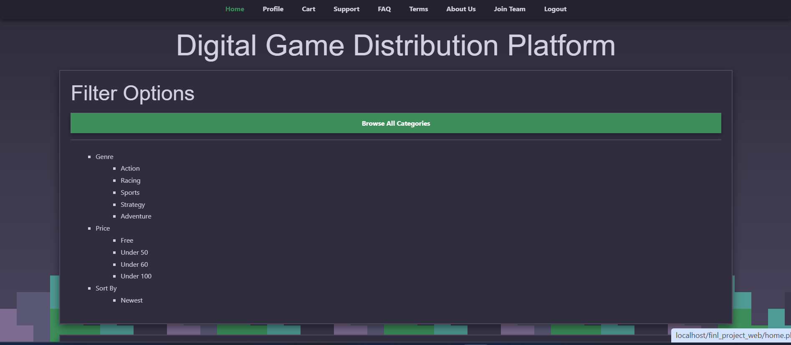
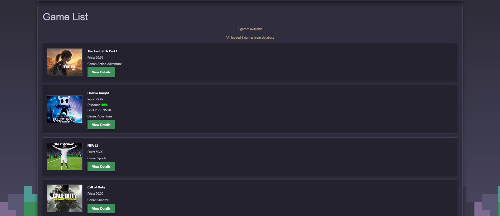
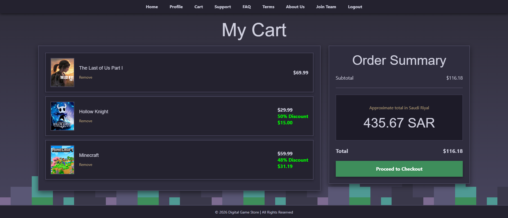
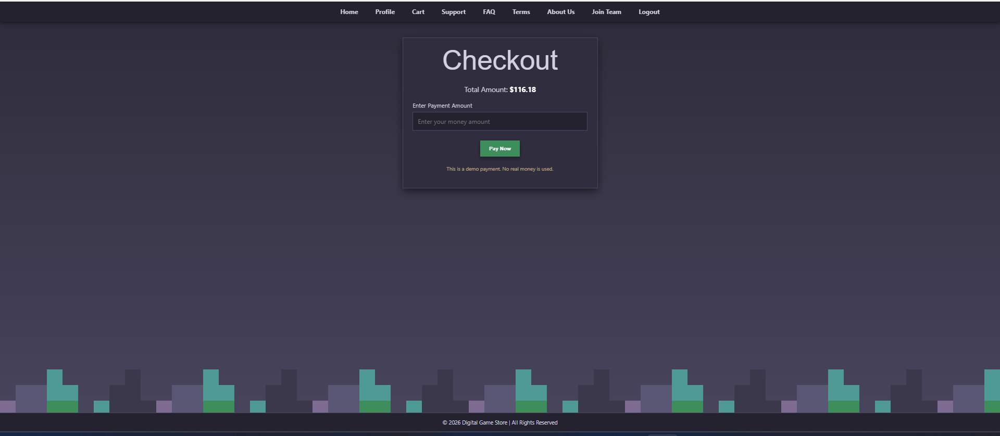
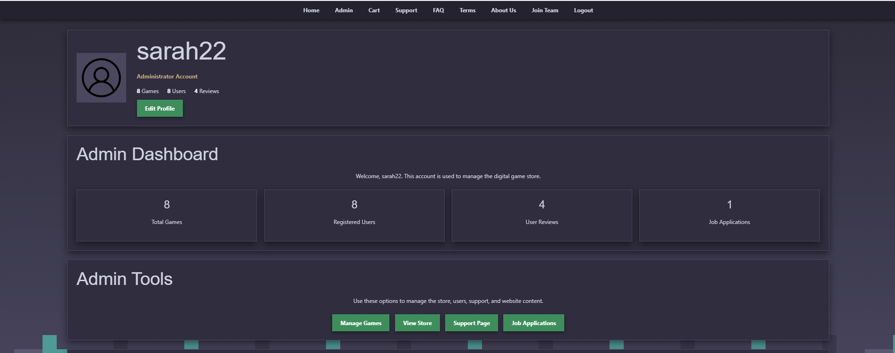

# Digital Game Store

Digital Game Store is a web development project designed for browsing and purchasing digital games. Users can create an account, explore games, add games to their cart, complete purchases, and write reviews.

## Features

- User login and registration
- Browse games by category
- Shopping cart
- Checkout system
- Game reviews and ratings
- User profile
- Admin dashboard
- Add, edit, and manage games
- Game discounts
- User library

## Technologies Used

- PHP
- MySQL
- HTML
- CSS
- JavaScript
- REST API
- XAMPP

## Project Screenshots

### Home Page

### Game List

### Shopping Cart

### Checkout

### Admin Dashboard

## My Contribution

My contributions to this project included:

- Developing parts of the Admin Dashboard
- Implementing game management features
- Working with PHP and MySQL
- Using JavaScript for validation and user interaction
- Integrating API functionality for game information
- Contributing to the database functionality

## Team Members

- Shahad Nasser Aldawsari
- Roaa Abbas Alhaddad
- Fatima Alsayed
- Sarah Alabbad
- Lama Al-Alshaikh
- Batool Al Fardan
- Zahra Al-Mari

## Project Purpose

This project was developed as a university web development project to practice full-stack web development concepts, database integration, user authentication, and interactive web functionality.
